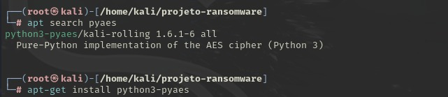
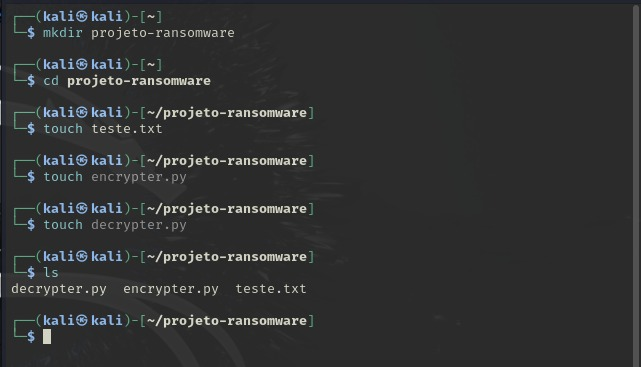
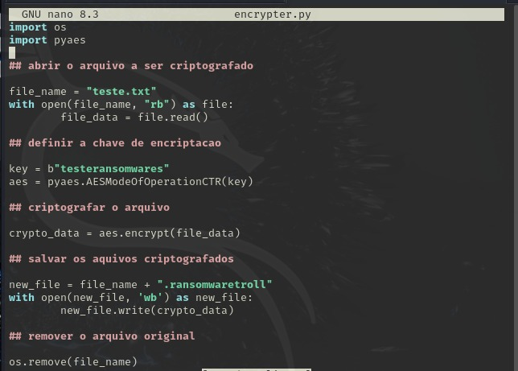
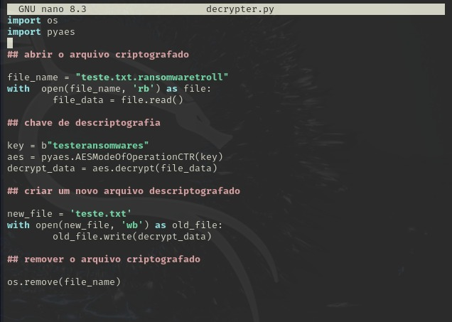
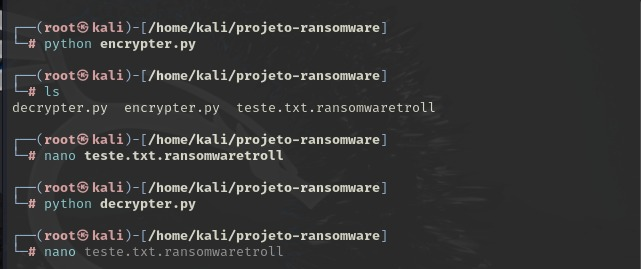
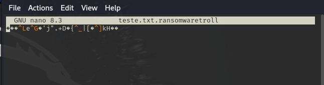
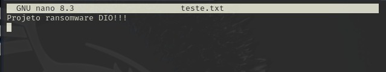

# Desafio-ransomware-DIO
Criação de um ransomware para criptografar arquivos, desafio proposto pelo Bootcamp de cibersegurança da DIO.

# Ferramentas:
- kali

# Baixando a biblioteca pyaes
Para realizar o ataque devemos antes de tudo verificar se a biblioteca que usaremos para importar as funções no nosso código está instalada na nossa maquina para isso execute:



- Após a instalação execute ```apt-get update && apt-get upgrade``` para atualizar e salvar as mudanças.

# Criando os arquivos
Concluindo a instalação podemos seguir para o ataque e começamos com a criação dos arquivos que usaremos para executar os comandos:

- Crie dois arquivos para adicionar o código de criptografia e descriptografia, um arquivo de ```.txt``` para colocar a mensagem e uma pasta para organizar esses arquivos:



# Realizando os códigos
O código de criptografia segue os seguintes passos:

- Abrir o arquivo ```.txt``` com a mensagem que será codificada;
- Definir a chave de criptografia;
- Criptografar o arquivo;
- Salvar o arquivo criptografado no lugar do antigo;
- Apagar o arquivo antigo, deixando apenas o criptografado;



E o código de descriptografia segue os seguintes passos:

- Abrir o arquivo criptografado;
- Definir a chave de descriptografia e decriptografar o arquivo;
- Criar um novo arquivo descriptografado;
- Apagar o arquivo criptografado, deixando o arquivo legivel como era no inicio;



Não esqueça de adicionar a mensagem desejada no arquivo ```.txt```, para que você consiga visualizar a codificação.

# Testando o ataque

Para realizar o ataque basta executar ```python (arquivo.py)```, Substituindo o "arquivo.py" pelo nome do seu arquivo e para confirmar se funcionou abra o arquivo ```.txt``` para ver o texto:



- Saida criptografada:



- Saida descriptografada:



